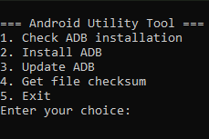

# Android Utility

  

## Description

This application provides utility for android. As of now there's not much to offer.
## Utilities
- Platform-Tools
- Hash algorithm for file checksums.

## Download And Run

### Requirements

- Eyes and Brain.

### RUN
- Download the executable from the [releases](https://github.com/A7E28/Androutil/releases) section. Please ensure to download the correct version (32-bit or 64-bit) according to your system architecture and run it. Windows might warn you, just run anyway.

## Contributing

Contributions are welcome! Fork this repository and submit a pull request to contribute.

## Issues

For any issues or feature requests, please open an issue on the repository.
